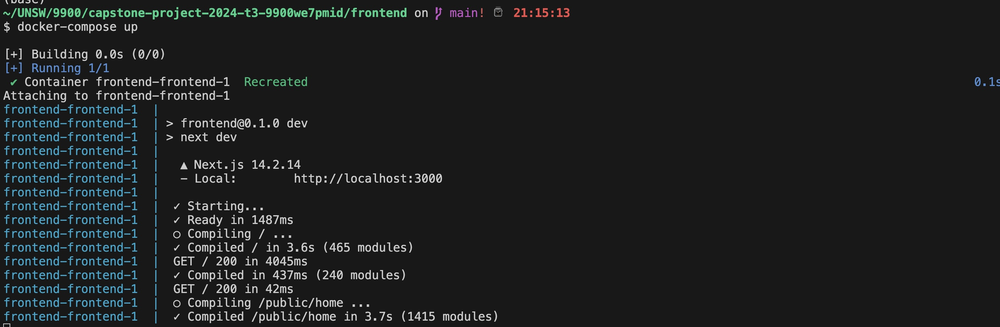
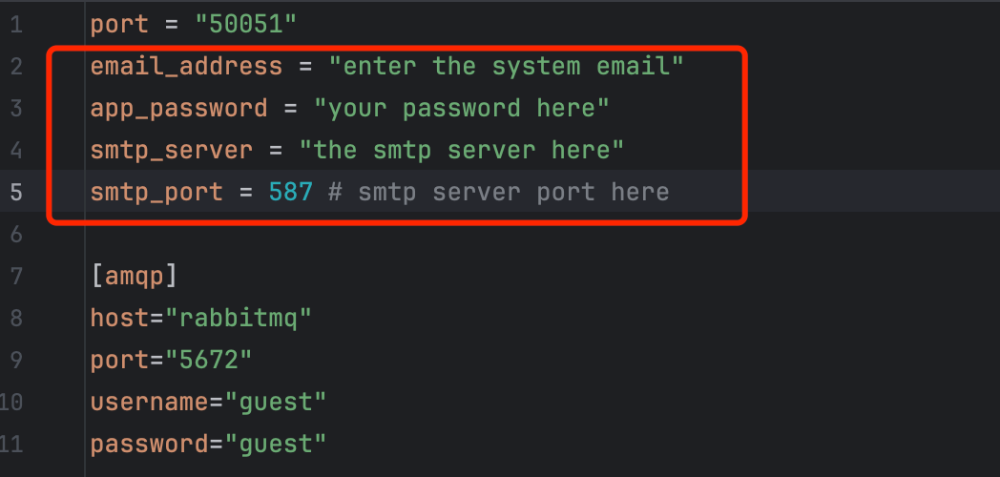

# ICPC team builder

A centralized website application provides team matching for competitors in ICPC


## Introduction

The ICPC Team Builder platform is designed to help users find and match with ideal teammates for competitions based on their preferences and criteria. 

Our solution focuses on a user-centered approach, emphasizing ease of registration and intuitive navigation, allowing users to quickly access guidance and efficiently connect with compatible teammates. Each feature of the platform has been developed to make an user-friendly experience for exploring potential team members and building teams tailored to individual goals.

---


## Installation and Usage

### Prerequisites

Ensure the following prerequisites are met before proceeding:

- Operating System: Compatible with Docker and Docker Compose.
- Software dependencies:
    - Docker
    - Docker Compose

### Installation

Clone the repository:

```bash
git clone https://github.com/unsw-cse-comp99-3900/capstone-project-2024-t3-9900W19AMeetingIsDestiny.git
```
**Frontend**
1. cd to the frontend directory:
   
    ```bash
    cd ~/capstone-project-2024-t3-9900W19AMeetingIsDestiny/frontend/
    ```
2. Run the following command to use docker-compose to build the frontend:
   
    ```bash
    docker-compose up
    ```
    
    
    
    The frontend will be available at http://localhost:3000.

**Backend**

1. Set up the system email configuration by editing the file located at backend/config/mailer.toml.
   
    
2. Navigate to the backend source code directory:
   
    ```bash
    cd ~/capstone-project-2024-t3-9900W19AMeetingIsDestiny/backend/
    ```
    
3. Build the backend Docker image using make:
   
    ```bash
    make docker-save
    ```
    
    .png)
4. Move to the Docker Compose configuration directory:
   
    ```bash
    cd ~/capstone-project-2024-t3-9900W19AMeetingIsDestiny/backend/bin_docker/ICPC_backend
    ```
    
5. Run the backend server in detached mode using Docker Compose:
   
    ```bash
    docker compose up -d
    ```
    
    .png)
    
    The backend API will be available at http://localhost:8088.
    


### **How to Use**

1. Access the frontend and log in with the default admin credentials:
   
    Username: admin
    
    Password: icpcAdmin!
    
2. Use the “Field Management” menu to update the list of supported schools and their corresponding email domains. This ensures that only registered schools can use the system. Accounts are automatically linked to schools based on email domains.
3. In the “Competition Management” section, configure competition phases and their respective time nodes. Once each phase ends, the system will automatically include eligible students in the matching process.
4. Use the “User Management” section to add coach accounts for registered schools and site coordinator accounts. These accounts have permissions specific to their roles.
5. Coaches can log in to view team formation results for their school after the matching process ends. They can manually adjust team composition, publish the results, and allow students to log in and view their assigned teams.
6. Site coordinators can view logistical information about registered students and site overviews.
7. Students can register using their school email, fill out required information, and participate in team formation. If needed, students can invite a second member to join their team.


## Features

**Feature 1: User Introduction to ICPC Team Builder**

.png)

The homepage introduces users to the ICPC Team Builder platform, highlighting its purpose and functionality. It includes:

- A clear explanation of what ICPC Team Builder is and how it works.
- Instructions for using the website tailored for different roles (coaches, team members, etc.).
- Buttons for signing in and signing up.
- Navigation links for enhanced user experience:
- Homepage link.
- ICPC official website for additional resources.
- A “Help” section providing detailed guidance for new users.
- A footer with group information, product details, and website terms and conditions.

The logo symbolizes teamwork, with each member like a gear contributing to the overall team, reflecting both functionality and collaboration.


**Feature 2: Sign In/Sign Up Page**

.png)

Users can register and log in with their university email. Key features include:

- A sign-up page requiring:
    - Username, password (with confirmation), and university email.
    - Verification code sent to the user’s email.
    
- A password reset page that allows users to:
    - Enter a new password and verification code within 60 seconds.
    
    - User-friendly buttons for creating accounts, resetting passwords, or navigating back to the homepage.
    
    - The background image reflects the theme, shot by a team member in the South Pacific.
    
      

**Feature 3: Profile Creation**

.png)

Users must create a personal profile before proceeding with team matching. Features include:

- Editable fields for:
    - Full Name, T-shirt Size, Gender, Preferred Pronouns, Dietary Requirements, and ICPC Global Account status.
    
    - Buttons for saving, resetting, or canceling changes.
    
    - A sidebar for navigation between sections, ensuring users complete required steps in order (e.g., Profile → Skills → Team Selection).
    
      

**Feature 4: Team Matching Functionality**

.png)

This feature collects user data for the matching algorithm. Key functionalities include:

- Programming Language Selection: Users choose their preferred languages (e.g., Java, Python).
- Completed Courses: Users select relevant programming-related courses.
- Competitive Programming Experience: Users describe their level of experience in a text box.
- eam Selection Preferences: Users specify individuals they do not wish to team up with.

The system uses this information to group users based on skills and preferences, ensuring optimal team compatibility.


**Feature 5: Invitation Page**

.png)

Users can invite teammates or accept invitations from others.

- Search functionality for finding specific teammates.

- Options to accept or delete invitations.

- Users can skip this step to view match results directly.

  

**Feature 6: Match Result Page**

.png)

This page displays final team assignments after coach approval. Features include:

- Viewing team members and current team status.
- Options to change the team name.
- A clear overview of the match results, ensuring users can quickly understand their assignments.

These features collectively create a seamless and user-friendly experience for all ICPC Team Builder participants.


## Contributors

### Frontend

Skyrim Wu

Junjie Huang

Rui Zhang

### Backend

Xiaochuan Zhang

Xiangjie Ma

Yan Zheng